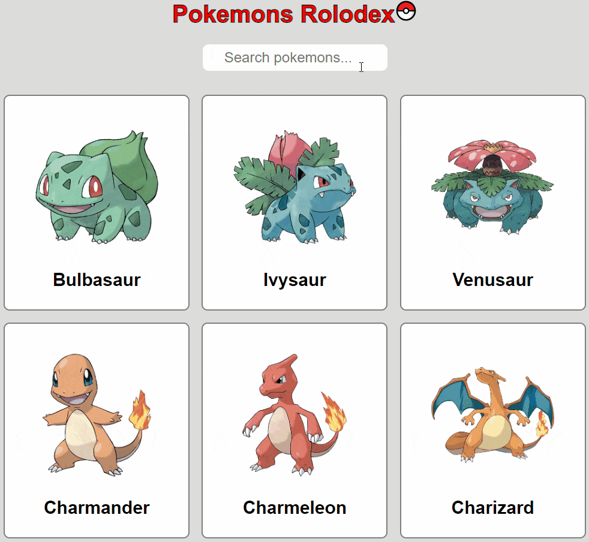

# Pokemons Rolodex 

Application created with [React](https://reactjs.org/) and deployed on [Github Pages](https://pages.github.com/), :point_right: **[you can visit its demonstration here](https://pathei-kosmos.github.io/pokemons-rolodex/)** :point_left:. 

The app uses [class-based components](https://reactjs.org/docs/react-component.html). It `fetch()` pokemons (their names and images) from [PokéAPI](https://pokeapi.co/), and enables search by name.



## Requirements

* npm 
* Git
* CLI

## Setup

Clone the repo and install the dependencies.

```bash
git clone https://github.com/pathei-kosmos/pokemons-rolodex
cd pokemons-rolodex
```

```bash
npm install
```

Launch the live server:
```bash
npm start
```

